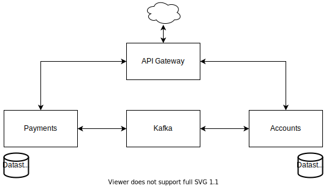

== ACME FINANCIAL SAGA SERVICES

Sample project to demonstrate usage of orchestrated (via Kafka) microservice SAGA + Outbox(Polling) patterns. Project based on Spring Boot Webflux framework using non-blocking code until SQL data storage (JPA part is blocking).
Supported currencies EUR, USD.

.Composition
* Spring Boot Webflux microservices (using Non-blocking Kafka prod/cons)
* Kafka
* PostgreSQL / H2

== Requirements & Supported Platforms

.Requirements
* Java 11 (OpenJDK 11+)
* Gradle 6.3 (Kotlin 1.3+)
* Intellij CE 2019.1+ (IDE)
* Docker (Docker compose)

.Supported Platforms
* Docker
* IDE (locally)

== Installation & Run

.Run using docker
[source,bash]
----
docker-compose up -d
----

.Run using IDE
[source,bash]
----
# Set main classes for each microservice (agw, account, payment)
# Set -Dspring.profiles.active=psql or -Dspring.profiles.active=h2 as VM option (account, payment)

# Run docker compose for Kafka
docker-compose -f docker-compose-ide.yml up -d
----

Then hit `http://localhost:3000/docs` for more info.

Use one of supported accounts:

.Accounts (Basic auth)
|===
|Username |Password |IBAN

|AT483200000000000001
|password
|AT483200000000000001

|AT483200000000000002
|password
|AT483200000000000002
|===

== References

* link:https://projectreactor.io/[projectreactor.io]
* link:https://spring.io/[spring.io]